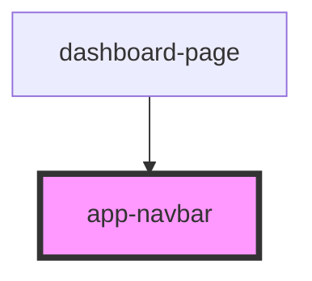

# app-navbar

<!-- Auto Generated Below -->

## Properties

| Property | Attribute | Description | Type     | Default     |
| -------- | --------- | ----------- | -------- | ----------- |
| `role`   | `role`    |             | `string` | `undefined` |

## Events

| Event       | Description | Type                  |
| ----------- | ----------- | --------------------- |
| `handleNav` |             | `CustomEvent<string>` |

## Dependencies

### Used by

 - [dashboard-page](../dashboard-page)

### Graph

----------------------------------------------

*Built with [StencilJS](https://stenciljs.com/)*
