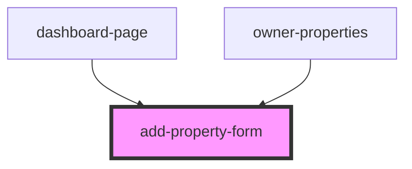

# add-property-form

<!-- Auto Generated Below -->

## Properties

| Property | Attribute | Description | Type     | Default     |
| -------- | --------- | ----------- | -------- | ----------- |
| `source` | `source`  |             | `string` | `undefined` |
| `user`   | `user`    |             | `number` | `undefined` |

## Events

| Event        | Description | Type                  |
| ------------ | ----------- | --------------------- |
| `pageRender` |             | `CustomEvent<string>` |

## Dependencies

### Used by

 - [dashboard-page](..)
 - [owner-properties](../owner-properties)

### Graph

----------------------------------------------

*Built with [StencilJS](https://stenciljs.com/)*
