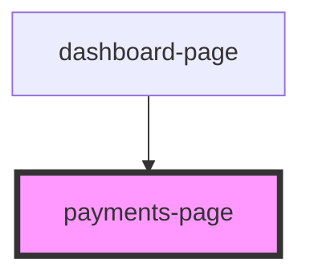

# payments-page

<!-- Auto Generated Below -->

## Properties

| Property | Attribute | Description | Type     | Default     |
| -------- | --------- | ----------- | -------- | ----------- |
| `role`   | `role`    |             | `string` | `undefined` |
| `userId` | `user-id` |             | `number` | `undefined` |

## Dependencies

### Used by

 - [dashboard-page](..)

### Graph

----------------------------------------------

*Built with [StencilJS](https://stenciljs.com/)*
