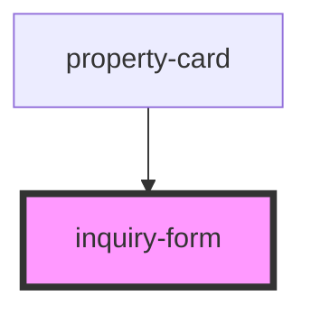

# inquiry-form

<!-- Auto Generated Below -->

## Properties

| Property     | Attribute     | Description | Type               | Default     |
| ------------ | ------------- | ----------- | ------------------ | ----------- |
| `propertyId` | `property-id` |             | `number \| string` | `undefined` |
| `showForm`   | `show-form`   |             | `boolean`          | `undefined` |

## Events

| Event       | Description | Type                |
| ----------- | ----------- | ------------------- |
| `closeForm` |             | `CustomEvent<void>` |

## Dependencies

### Used by

 - [property-card](../property-card)

### Graph

----------------------------------------------

*Built with [StencilJS](https://stenciljs.com/)*
