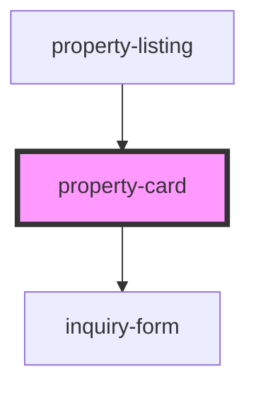

# property-card

<!-- Auto Generated Below -->

## Properties

| Property                 | Attribute        | Description | Type       | Default     |
| ------------------------ | ---------------- | ----------- | ---------- | ----------- |
| `bookingStatus`          | `booking-status` |             | `boolean`  | `undefined` |
| `propertys` _(required)_ | --               |             | `Property` | `undefined` |
| `role`                   | `role`           |             | `string`   | `undefined` |

## Events

| Event            | Description | Type                                                      |
| ---------------- | ----------- | --------------------------------------------------------- |
| `addToFavorites` |             | `CustomEvent<{ favorite: boolean; property: Property; }>` |
| `booking`        |             | `CustomEvent<{ booked: boolean; property: Property; }>`   |

## Dependencies

### Used by

 - [property-listing](..)

### Depends on

- [inquiry-form](../inquiry-form)

### Graph

----------------------------------------------

*Built with [StencilJS](https://stenciljs.com/)*
