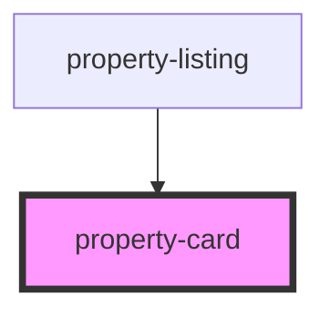

# property-card

<!-- Auto Generated Below -->

## Properties

| Property                 | Attribute | Description | Type       | Default     |
| ------------------------ | --------- | ----------- | ---------- | ----------- |
| `propertys` _(required)_ | --        |             | `Property` | `undefined` |

## Dependencies

### Used by

 - [property-listing](..)

### Graph

----------------------------------------------

*Built with [StencilJS](https://stenciljs.com/)*
