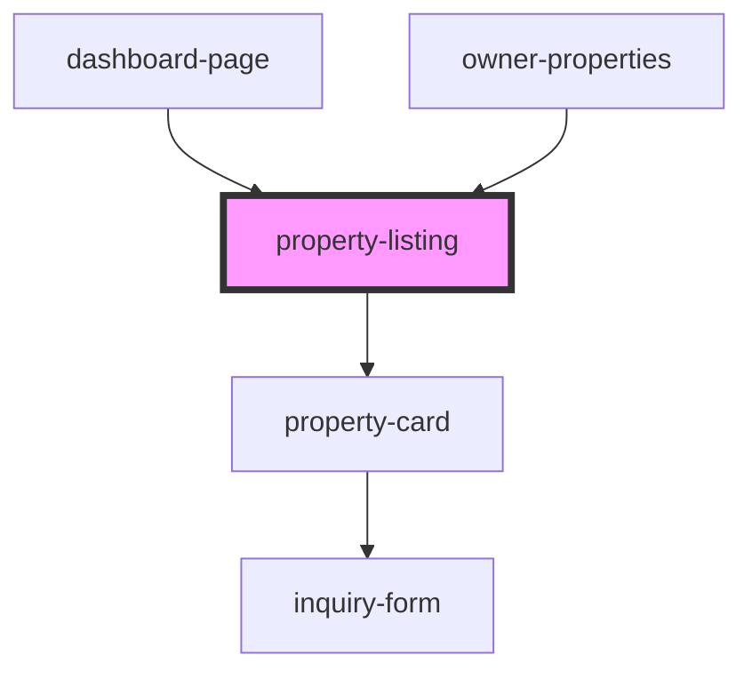

# property-listing

<!-- Auto Generated Below -->

## Properties

| Property            | Attribute | Description | Type         | Default     |
| ------------------- | --------- | ----------- | ------------ | ----------- |
| `listingProperties` | --        |             | `Property[]` | `[]`        |
| `source`            | `source`  |             | `string`     | `undefined` |
| `user`              | `user`    |             | `number`     | `undefined` |

## Dependencies

### Used by

 - [dashboard-page](..)
 - [owner-properties](../owner-properties)

### Depends on

- [property-card](property-card)

### Graph

----------------------------------------------

*Built with [StencilJS](https://stenciljs.com/)*
